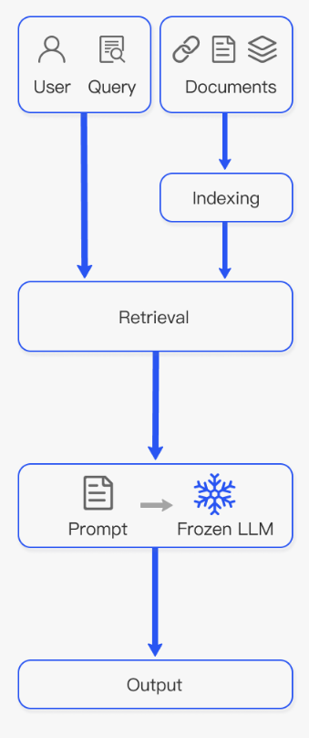
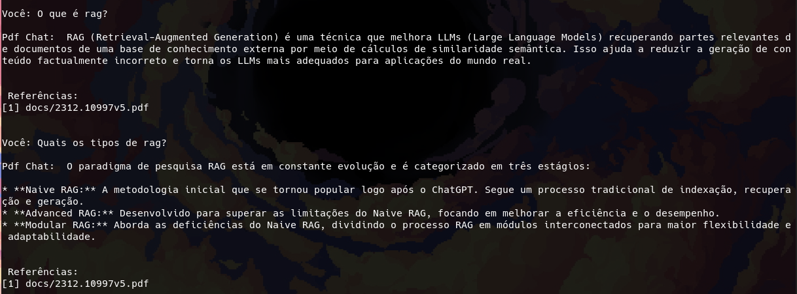

# PDF Chat

## Descrição

Se você é como eu e baixa mais PDFs do que consegue ler quando está estudando um tópico novo esse assistente pode te ajudar. Coloque seus documentos da pasta `docs` e faça perguntas relacionadas a seus conteúdos.

O projeto usa a técnica de Retrieval Augmented Generation, que  seleciona os trechos mais relevantes dos textos em relação à sua pergunta para gerar um contexto dinâmico que auxilia o Gemini a respondê-la.

Ferramentas usada: Extração de textos, segmentação, embeddings, similaridade semântica e few-shot learning.



Fonte: [Retrieval-Augmented Generation for Large
Language Models: A Survey](https://arxiv.org/pdf/2312.10997)

## Instalação

Instale o `poetry` se ainda não tiver

```bash
pip install -U poetry
```

Instale as dependências

```bash
poetry install
```

Crie um arquivo chamado`.env` e coloque sua chave da API do Gemini como mostrado em `.env.example`

## Executando localmente

```bash
poetry ryn python pdf_chat.py
```

### Exemplo

